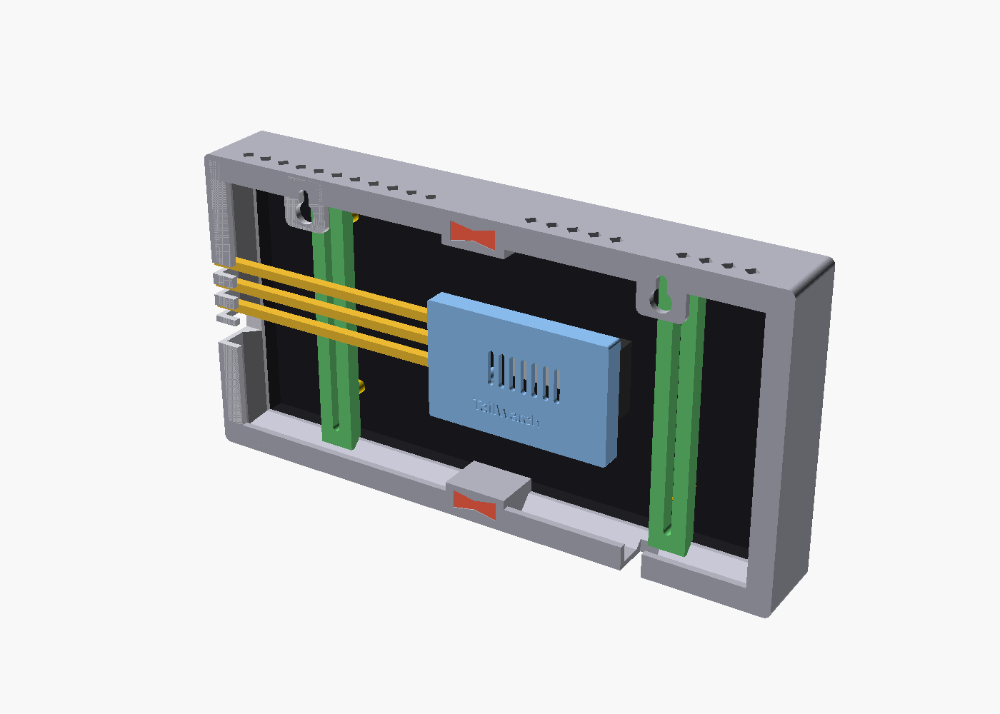
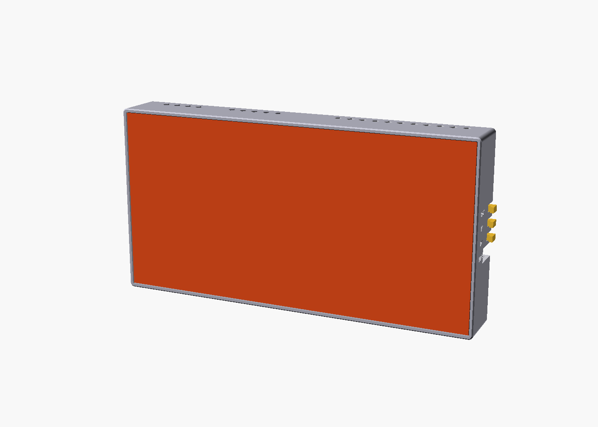
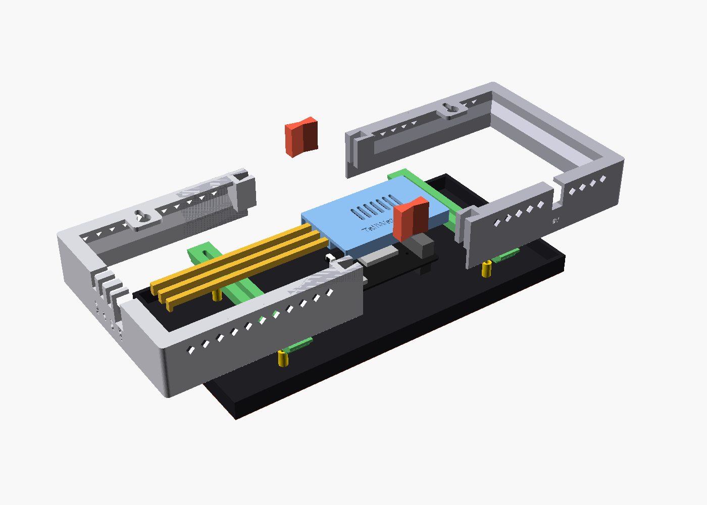
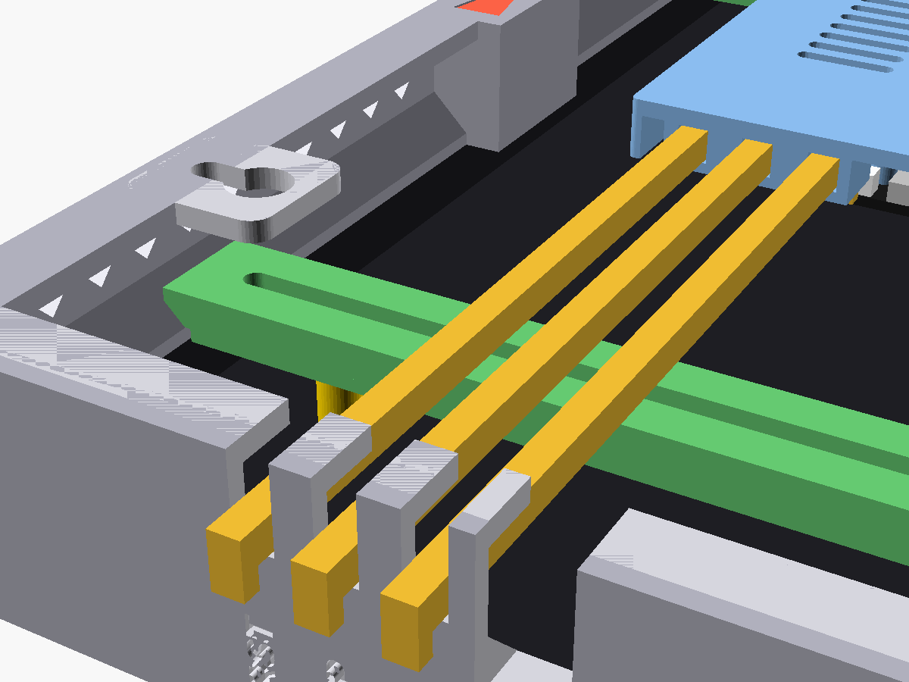

# TailWatch S3 enclosure (3D-printable, parametric OpenSCAD)

A wall-hung frame for the TailWatch display: an **Adafruit MatrixPortal S3**
plugged straight into the HUB75 input of a **128x64, 2 mm pitch (256 x 128 mm)
indoor panel**. The front stays open. The only thing you see around the LEDs
is the 2.5 mm frame wall, and nothing covers any pixel. USB-C and the
DOWN / UP / RESET buttons are reachable from the edge of the frame while it
hangs on the wall.




> **Measure your panel before printing.** The panel is a secondary-market part,
> so its shell depth, mounting-post positions and HUB75 header location vary by
> manufacturer and batch. The model is laid out so that most of that variance
> doesn't change the printed parts, but a few numbers in `params.scad` must
> match your hardware. See [Parameters to check](#parameters-to-check-before-printing).

## Parts

Every part was rendered with OpenSCAD 2021.01 and checked by
`tools/check_stl.py`. The STLs are exported in print orientation, and none
needs supports.

| STL | Qty | What it is | Size as exported (mm) | Print orientation |
|---|---|---|---|---|
| `stl/frame_left.stl`  | 1 | Left half of the perimeter frame, seen from the back (x < `seam_x`). Has the USB and button notches in the default layout. | 131.0 x 134.0 x 35.5 | Wall side down |
| `stl/frame_right.stl` | 1 | Right half of the frame, with the 5 V cable notch. | 131.0 x 134.0 x 35.5 | Wall side down |
| `stl/strap.stl`       | 2 (one per `strap_xs` entry) | Slotted rear strap. It screws into the panel's M3 posts, and its bevelled ends lock behind the frame ledges. | 16.0 x 123.0 x 6.9 | Flat side down |
| `stl/portal_pod.stl`  | 1 | Hood over the MatrixPortal S3. It screws to the board's 4 M2.5 holes and carries the push-rod guide tunnels. | 81.5 x 51.4 x 14.2 | Roof down |
| `stl/button_rods.stl` | 1 plate (3 rods) | Push-rods for DOWN, UP and RESET, engraved D / U / R. | 125.5 x 40.7 x 4.0 | Flat, as exported |
| `stl/bowtie_keys.stl` | 1 plate (2 keys) | Bowtie keys that join the frame halves at the top and bottom seams. | 44.0 x 8.0 x 20.8 | Standing, as exported |

**Build volume:** every part must fit the target printer's
**200 x 200 x 250 mm** volume. The largest part (a frame half) is
131 x 134 x 35.5 mm, which leaves more than 60 mm of margin in X and Y. The
panel is 256 mm wide, so the frame is split at `seam_x` into two halves
joined by bowtie keys; no single part needs a big bed. The limit is set in
three places:

- `bed` in `params.scad`, which also drives console warnings for rods or
  frame halves that would outgrow it;
- `BED` in `tools/build.sh`;
- the default in `tools/check_stl.py`.

All three are 200 x 200 x 250, and the checker fails any STL that doesn't fit.

`assembly.scad` is a preview only (dummy panel and board). It is not a part.

### Hardware

- 4x **M2.5 x 6 pan-head** screws: pod to MatrixPortal, driven from under the PCB into the printed posts. Nylon or steel both work. If there is no room under the board, set `pod_fix = "pins"`.
- 2-4x **M3** screws: straps to the panel's threaded posts. The strap is 6.9 mm thick at the slot, so M3 x 10 to M3 x 12 is typical. Check your posts' thread depth and don't bottom out.
- 2x **wall screws**: head 8.5 mm diameter or less, shank 4.3 mm or less (#6/#8 or 3.5-4 mm pan or round head), plus wall anchors. Leave each head standing about 3.5 mm off the wall.
- Optional: a drop of CA glue per bowtie key, and a zip tie on the 5 V cable as a strain-relief stop inside the frame.

## How it works (design notes)

- **Panel retention doesn't depend on the panel's hole pattern.** Each frame
  wall has a 45-degree wedge ledge that sits behind the panel's edge. The two
  straps screw into whatever M3 posts your panel has, and a long slot takes
  any Y position. Each bevelled strap end locks behind the top and bottom
  ledges, so the ledge is clamped between the panel (in front) and the straps
  (behind). You set the strap X positions (`strap_xs`) to match your posts;
  the printed strap is the same either way. If your panel has no posts, the
  strap's front rib can be stuck to the shell with VHB tape instead.
- **Split frame.** The two C-shaped halves slide onto the panel from the left
  and right. Their ledges pass between the panel back and the strap ends, and
  the halves meet at `seam_x`. Bowtie keys dropped in from the back align the
  seam. Structurally the halves are held by the panel edges and the straps,
  so the keys only need to align.
- **Wall mounting: keyhole slots.** There is one keyhole in the top rear
  flange of each half, 160 mm apart. I chose keyholes over a French cleat or
  screw tabs because:
  1. They add no extra parts. A French cleat for a 266 mm frame would be
     another long part to split, and it adds depth.
  2. They're hidden behind the frame.
  3. The whole display (panel about 0.35 kg plus a light frame) lifts off
     the screws without tools when you need the back.

  The slot runs **up** from the entry hole, so the frame drops onto the screw
  heads. With the defaults, drill the two screws **160 mm apart, level, about
  8 mm below where the top edge of the frame will be**.
- **Buttons from the edge.** On the MatrixPortal S3, USB-C, DOWN, UP and
  RESET all sit on one short edge and face sideways, parallel to the panel.
  The panel covers the front and the wall covers the back, so the pod guides
  three printed push-rods from that edge out through notches in the frame
  wall:
  - Each rod has a leg that rests 0.4 mm from its switch plunger.
  - Its finger pad sits outside the wall, and the pad stops against the wall
    after `pad_gap` (2 mm) of travel to protect the switch.
  - Rods ride behind the straps and above the USB plug.
  - Hold the **UP** pad and tap **RST** for USB-writable boot. Hold the
    **DN** pad for 5 s to trigger the easter egg.

  The labels USB / DN / UP / RST are engraved next to the notches. If your
  panel allows it, the nicest layout is `portal_rot = 90`, where the button
  edge faces down, the rods come out of the bottom edge, and they are short.
- **USB-C** stays plugged in: it is the S3's only power, per `../DESIGN.md`.
  The cable leaves through a notch in the same wall. All notches are open
  from the rear, so cables and rods drop in and there is nothing to thread.
- **Panel 5 V** enters through a rear-open notch in the bottom wall
  (`power_notch_x`). The barrel-jack-to-screw-terminal adapter lives inside
  the frame, wired to the panel's power input. Per `../DESIGN.md`, **do not**
  connect the panel supply to the MatrixPortal's M3 power posts, because that
  would back-feed USB.
- **Heat:** the panel draws about 15 W at full white. Diamond vents in the top
  and bottom walls let air rise through the cavity behind the panel. The
  diamond shape needs no bridging.
- **FDM rules followed:** walls are 2 mm or thicker. The ledges are 45-degree
  wedges printed from the wall side. Bridges are 10 mm or less (notch ends,
  rod tunnels). Vents are diamonds, and there are no overhangs past 45
  degrees in the exported orientations.




## Print settings

- **Material: PETG or ASA, not PLA.** The panel runs warm behind the LEDs,
  and the frame sits against its back shell for years. PLA can creep or
  soften at sustained temperatures around 50-60 C; PETG and ASA hold up.
  Printing the push-rods in PETG also keeps them stiff and slippery.
- Layer height: 0.2 mm. Use 0.16 mm for the pod and rods if you want crisper tunnels.
- Walls: 3-4 perimeters (1.2-1.6 mm). Infill: 20-30 % gyroid or grid. Use 100 % for the bowtie keys.
- **Supports: none.** Print every part in the orientation it was exported in.
- A 3-5 mm brim on the frame halves helps against warping, especially with ASA.
- Fit tuning, all in `params.scad` and marked `[TUNE]`:
  - `bt_clr` for the bowtie key fit.
  - `rod_clr` for rod tunnels and notches.
  - `panel_clr` for the panel-to-frame gap.
  - `pod_pilot_d` for the M2.5 self-tap pilot.

## Assembly order

1. **Measure and set the parameters** (next section), then run `tools/build.sh`.
   Check that `assembly.scad` shows no clashes and that the console prints no
   `WARNING` lines.
2. **Pod onto the board.** Set the pod over the MatrixPortal S3, component
   side, with the posts on the 4 mounting holes. Drive 4x M2.5 x 6 from the
   underside of the PCB into the posts. Don't overtighten into plastic.
3. **Straps onto the panel.** Lay the panel face-down on a soft towel. Screw
   the straps to the M3 posts (rib toward the panel, bevelled ends toward the
   top and bottom edges). Leave the screws a half-turn loose.
4. **Slide on the frame halves**, one from each side. Each half's ledge slips
   between the panel back and the strap ends. Push until the halves meet at
   the seam, then drop the two bowtie keys into the seam bosses from the
   back. Add glue if you like. Tighten the strap screws.
5. **Wire the 5 V feed.** Mount the barrel-jack adapter to the panel's power
   leads and lay the supply cable into the bottom notch. A zip tie around the
   cable inside the frame makes a pull stop.
6. **Rods into the pod.** Feed each rod's straight end out through its
   tunnel, from the board side, so the leg stays on the board side. D / U / R
   are engraved next to the pads.
7. **Plug in the MatrixPortal.** Press the board, pod and rods straight onto
   the panel's HUB75 input header by pushing on the pod roof. The rods drop
   into their wall notches with the pads outside.
8. **USB-C cable** into the port, laid into the USB notch. The cable can bow
   over a strap if one is in the way.
9. **Hang it:** put the keyholes over the two wall screws and let it drop.

## Parameters to check before printing

All values live in `params.scad`, grouped and commented. Coordinates are in
the **back view**: stand behind the panel, with X to your right, Y up, and
(0,0) at the panel's lower-left corner as seen from the back. Z is measured
from the LED face toward the wall. With the defaults, the button side is on
the display's **right** when you face it, because the back view is mirrored.

| Parameter | Default | Status | How to measure |
|---|---|---|---|
| `panel_thk` | 13.0 | **MEASURE** | LED face to the rearmost flat of the plastic shell, ignoring connectors. 13 mm is a typical listing value for P2 256x128 modules. |
| `hub75_in_xy` | [176, 64] | **PLACEHOLDER** | Centre of the HUB75 **input** header, back view. |
| `portal_rot` | 0 | **MEASURE** | Which way the board's USB/button edge points once plugged in: 0 = left, 90 = down, 180 = right, 270 = up (back view). |
| `portal_pcb_z` | 15.5 | **MEASURE** | Most important depth. With the board plugged in and the panel face-down on a table, this is the height of the MatrixPortal **PCB underside** above the table. For `pod_fix = "screws"` it must be at least `panel_thk + 2.2` so the M2.5 heads fit under the board; otherwise use `"pins"`. |
| `strap_xs` | [48, 208] | **PLACEHOLDER** | X of a column of M3 posts on each half. The strap must not cross the pod; the console warns if it does. |
| `panel_holes` | 4 corner-ish posts | **PLACEHOLDER** | Only used by the preview and the "strap lines up with a post" check. |
| `power_notch_x` | 200 | **PLACEHOLDER** | Put it near your panel's power input. |
| `keyhole_spacing` | 160 | choice | Distance between the two wall screws. |
| `pod_fix` | "screws" | choice | "screws" (4x M2.5) or "pins" (printed press-fit pins, no under-board room needed). |
| `pad_gap` | 2.0 | TUNE | Button over-travel stop. Reduce it only after test-fitting. |

Changing any of these moves the notches, rod lengths, pod position and frame
depth together. `frame_back_z` is automatic: it sits just behind the pod plus
`wall_gap_min`. The console echoes the result (34.5 mm for the defaults).

## What was verified vs. what is assumed

**Verified from Adafruit's published design files.** The Learn Guide and
product pages were unreachable from the build environment, so these come from
Adafruit's GitHub instead:

- MatrixPortal S3 PCB outline: **63.5 x 44.45 mm** (2.50" x 1.75"), corner radius 2.54 mm, 1.6 mm thick. Source: board outline (layer 20) in `Adafruit MatrixPortal S3.brd`. Adafruit's listing gives 63.6 x 44.3 x 20.0 mm overall.
- Mounting holes: 4x **2.5 mm** plated, at (7.62, 15.875), (7.62, 35.56), (48.26, 15.875) and (48.26, 35.56) mm from the lower-left corner in the Eagle top view.
- **USB-C** (CUI CUSB31-CFM2AX, top mount): mouth flush with the x = 0 short edge, centred at y = 8.255 mm.
- **Buttons** (E-Switch TL3330 right-angle), on the same edge with plungers pointing outward:
  - DOWN at y = 18.542 mm.
  - UP at y = 28.321 mm.
  - RESET at y = 38.100 mm.
  - Plunger tips at x = -1.07 / -0.94 / -0.44 mm, centre 3.37 mm above the PCB underside. The plunger positions come from Adafruit's 3D model.
- **HUB75:**
  - A **2x10 female socket on the underside** plugs onto the panel's 2x8 header. Adafruit's README says it "fits snugly into 2x8 HUB75 ports".
  - The socket is 5.33 x 25.4 mm and 5.55 mm deep below the PCB (3D model).
  - A **2x8 shrouded IDC plug on the top** is the output. Both are centred at (57.15, 22.225) mm, along the far short edge.
  - The IDC shroud is the tallest top-side part, at 10.64 mm above the PCB.
- **Power posts:** M3 SMT nuts at (58.42, 4.445) and (58.42, 40.132) mm.
- Closest top-side part to a mounting hole: the 100 uF cap, 2.65 mm from hole 1. The pod posts are therefore 4.6 mm in diameter.

**Not verified. These are adjustable, with generous clearances:**

- **Panel mounting-post positions and diameter.** No mechanical drawing is
  published for these panels. Adafruit said on its forum that it buys them on
  the secondary market and has no control over mounting-hole placement. The
  slotted-strap design means the printed parts don't depend on them.
- **Panel shell thickness** (13 mm from listings), **HUB75 header location**,
  box-header height, and so **`portal_pcb_z`**. All must be measured.
- **Location of the panel's power input.**
- **Switch plunger travel** (TL3330 datasheet not checked). The rod rest gap
  is 0.4 mm with a 2 mm hard stop, and both are tunable.
- **USB-C plug overmold size.** The notch (10 mm) is sized for the cable; the
  plug itself stays inside the frame.

## Rebuilding and checking

```sh
artifacts/tailwatch-s3/enclosure/tools/build.sh
```

This exports every STL, renders `preview/*.png` (it uses `xvfb-run` when
there is no display), and runs `tools/check_stl.py`. The checker reports, per
file:

- facet count;
- bounding box against the 200 x 200 x 250 mm bed;
- enclosed volume;
- an edge-manifold test: every edge must be shared by exactly two triangles, in opposite directions.

OpenSCAD's own logs are written to `logs/` and report `Simple: yes` and the
volume and facet counts for each part.

Last run: all 6 STLs are manifold and fit the **200 x 200 x 250 mm** bed.
The largest is 131.0 x 134.0 x 35.5 mm (frame halves); the longest is the
rod plate at 125.5 mm. For robustness I also
rendered `portal_rot` = 90, 180 and 270 with other header positions, and
`pod_fix = "pins"`. All of them came out manifold and in-bed.

## Files

| File | Purpose |
|---|---|
| `params.scad` | **All adjustable parameters**, derived values and sanity checks. |
| `tailwatch_lib.scad` | Geometry for every part, in assembled position, plus the print orientations. |
| `frame_left.scad`, `frame_right.scad`, `strap.scad`, `portal_pod.scad`, `button_rods.scad`, `bowtie_keys.scad` | One file per printable part. |
| `assembly.scad` | Preview. Use `-D explode=40` for exploded and `-D upright=true` for the wall-hung orientation. |
| `tools/build.sh`, `tools/check_stl.py` | Build and verification scripts. |
| `stl/`, `preview/`, `logs/` | Generated output. |

## Sources

- Adafruit MatrixPortal S3 PCB (Eagle `.brd`/`.sch`): <https://github.com/adafruit/Adafruit-MatrixPortal-S3-PCB>
- Adafruit CAD parts, "5778 Matrix Portal S3" STEP/STL: <https://github.com/adafruit/Adafruit_CAD_Parts>
- Product page (dimensions quoted via search listing): <https://www.adafruit.com/product/5778>. Learn Guide pinouts: <https://learn.adafruit.com/adafruit-matrixportal-s3/pinouts>
- Adafruit forum, "Mechanical drawing of 64x64 P2 matrix" (no drawings, hole placement not controlled): <https://forums.adafruit.com/viewtopic.php?t=220587>
- Typical P2 256x128 module listing (13 mm thickness, 128x64, HUB75E): <https://www.amazon.com/Indoor-128x64-Module-256mm128mm-256128mm/dp/B0869P1DCH>
- Project hardware and power notes: `../DESIGN.md` section 3 (panel on external 5 V, S3 on USB-C only).
